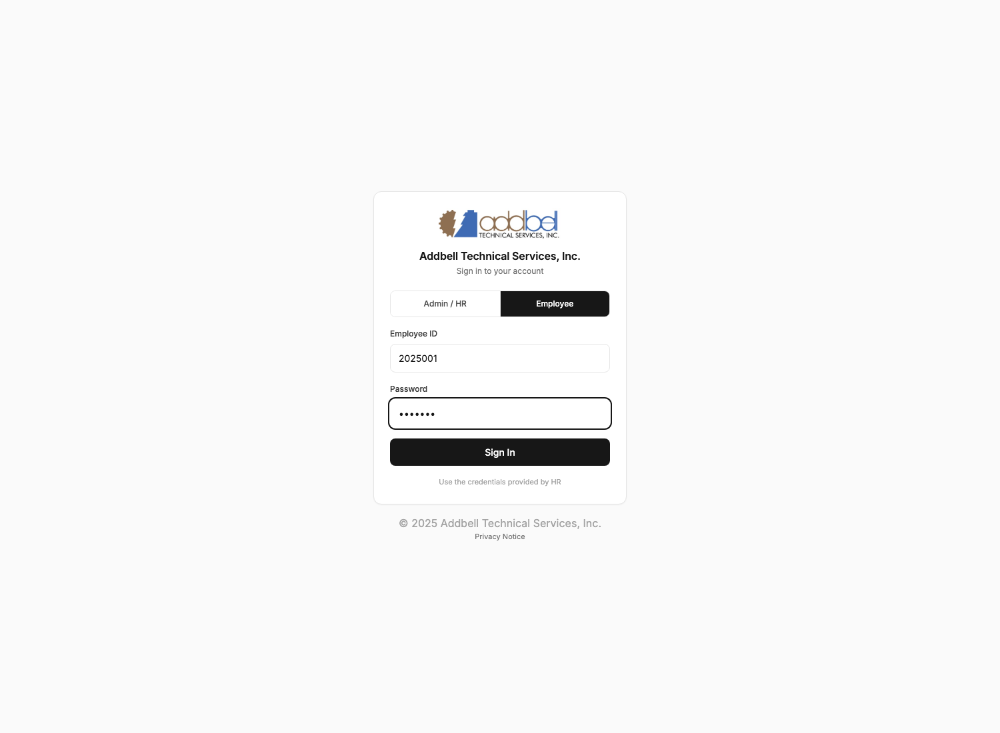
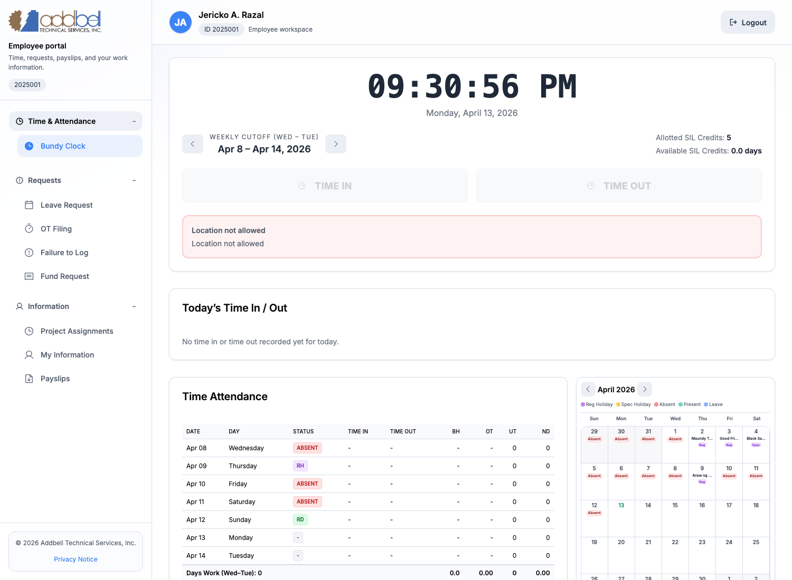
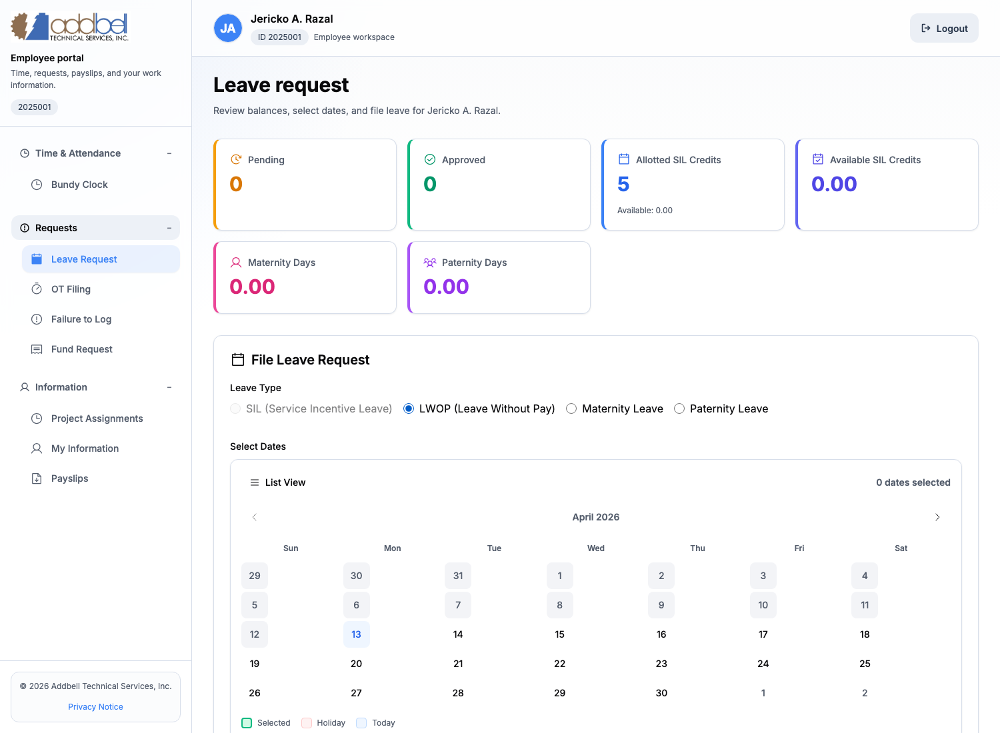
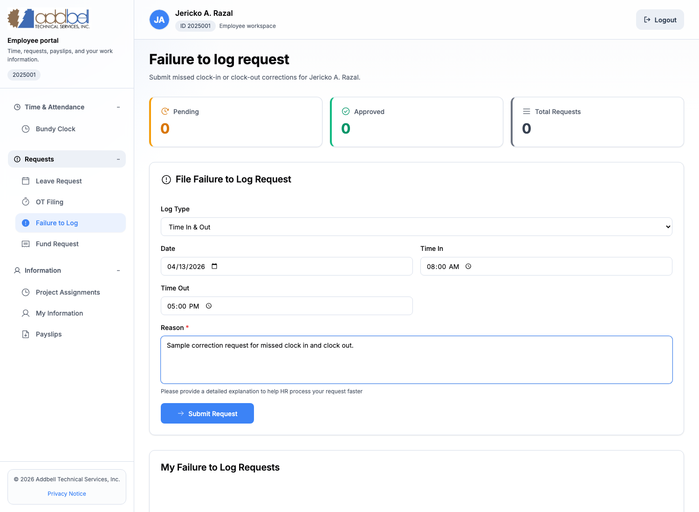
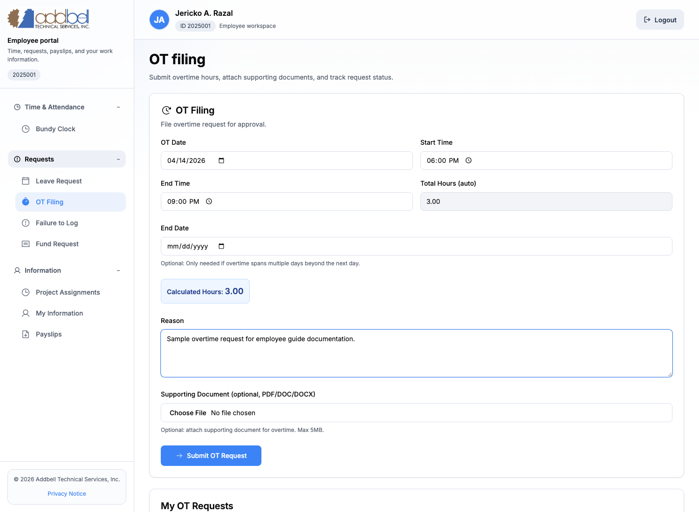
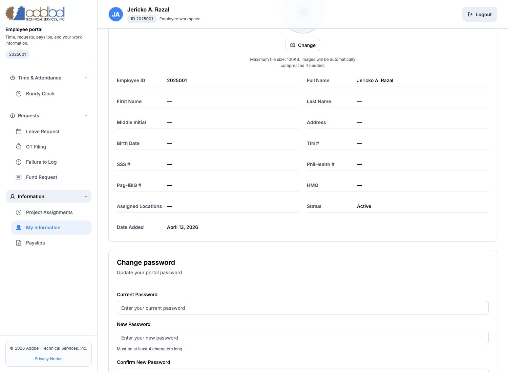
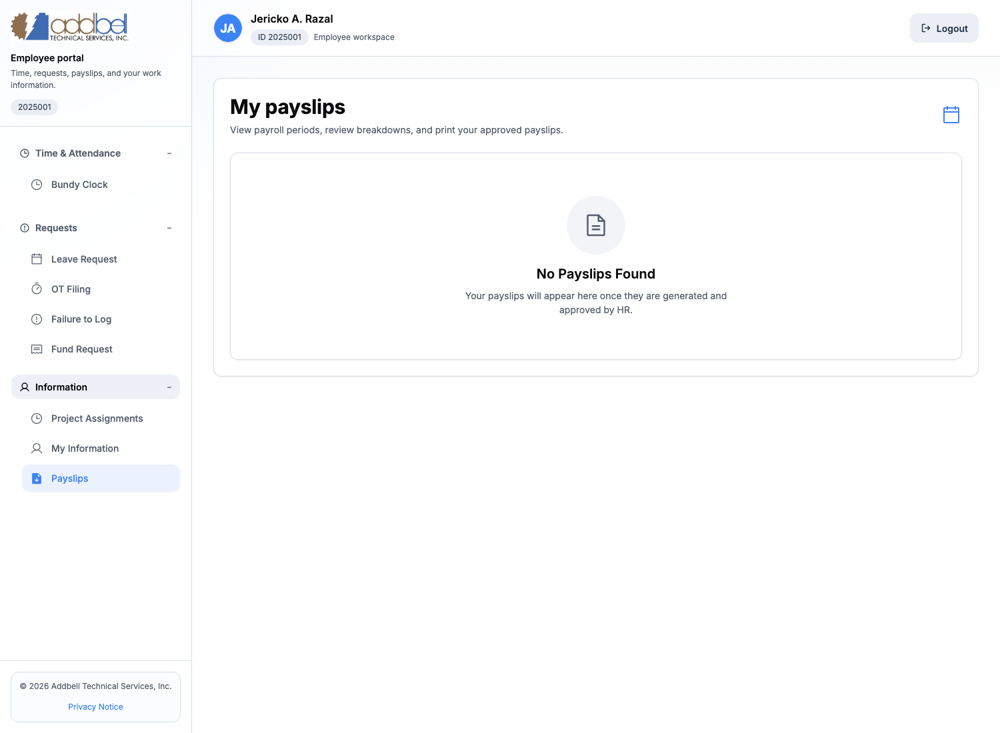
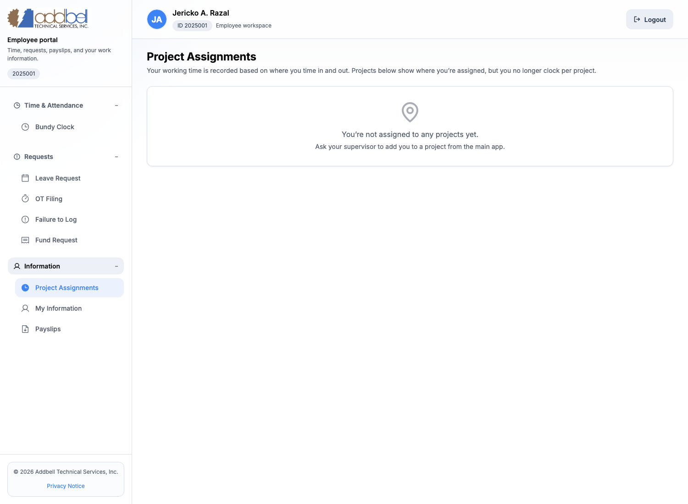

# Employee Portal Guidebook

This guide is for employees using the Addbell employee portal for attendance and self-service tasks.

This guide covers:

- logging into the employee portal
- using the `Bundy Clock` for time in and time out
- filing `Leave Request`
- filing `Failure to Log`
- filing `OT Filing`
- viewing `My Information`
- changing your portal password
- viewing `Payslips`
- checking `Project Assignments`

This guide does **not** cover:

- `Fund Request`
- `Purchase Order`

Screens may vary slightly depending on your assigned access, available data, and HR setup, but the overall flow stays the same.

---

## Before you start

Prepare these first:

- your `Employee ID`
- your current employee portal password
- location services enabled on your phone or computer if you will use `Bundy Clock`
- any supporting document needed for leave or overtime, if HR requires one

Important reminders:

- if you forgot your password, ask HR to reset it for you
- if you know your current password, you can change it yourself in `My Information`
- `Bundy Clock` depends on your GPS/location and approved work site assignment

---

## 1. Sign in to the employee portal

1. Open the login page.
2. Switch to `Employee`.
3. Enter your `Employee ID`.
4. Enter your password.
5. Click `Sign In`.

After login, you will enter the employee workspace and can open attendance, requests, payslips, and profile tools from the left sidebar.

---

## 2. Understand the employee portal menu

The employee portal sidebar is organized into these sections:

- `Time & Attendance`
- `Requests`
- `Information`

Main employee functions available today:

- `Bundy Clock`
- `Leave Request`
- `OT Filing`
- `Failure to Log`
- `Project Assignments`
- `My Information`
- `Payslips`

If a page is empty, that usually means:

- you do not have any records yet
- HR has not created data for that section yet
- your current work location or project assignment has not been set up yet

---

## 3. Use Bundy Clock for time in and time out

Open `Bundy Clock` from the sidebar to record attendance.

What you will see on this page:

- the current time and date
- the current weekly cutoff period
- your allotted and available SIL credits
- `Time In` and `Time Out` buttons
- your location status
- your `Today’s Time In / Out` summary
- your weekly `Time Attendance` table and calendar

### How to time in or time out

1. Open `Bundy Clock`.
2. Check the location status message.
3. If your location is accepted, click `Time In` at the start of work.
4. Click `Time Out` when your shift ends.

### If the page says location is not allowed

That means the portal sees that you are:

- outside the allowed work site radius, or
- not yet assigned to a valid clock location, or
- using a device with location services disabled

What to do:

- enable GPS or location access on your device
- move into the approved work site area
- ask HR if your clock location assignment needs to be updated

### Bundy Clock tips

- do not time in and out repeatedly unless HR told you to do so
- review `Today’s Time In / Out` right after punching
- use `Failure to Log` if a punch was missed or incorrect

---

## 4. File a leave request

Open `Leave Request` from the sidebar when you need to request leave.

This page shows:

- leave counters and credits
- the leave filing form
- date selection calendar
- your leave history and statuses

### Leave types available

- `SIL`
- `LWOP`

### How to file leave

1. Open `Leave Request`.
2. Choose the leave type.
3. Select one or more dates on the calendar.
4. Enter your reason.
5. Attach a supporting document if needed.
6. Click `Submit Leave Request`.

### Leave request rules to know

- weekends and holidays are not counted the same way as regular workdays
- `LWOP` can show half-day options after you select dates
- supporting files must be `PDF`, `DOC`, or `DOCX`
- the file size limit is `5MB`

### Leave request statuses

- `pending`: waiting for approval
- `approved_by_manager`: manager approved, waiting for HR
- `approved_by_hr`: fully approved
- `rejected`: denied
- `cancelled`: cancelled by the employee before final processing

### When to use leave vs failure to log

Use `Leave Request` when:

- you will be absent for approved leave
- you are formally requesting SIL or LWOP

Do not use `Leave Request` for a missed time in or time out. Use `Failure to Log` for that instead.

---

## 5. File a failure to log request

Open `Failure to Log` when you forgot to record a punch or your time entry needs correction.

This page shows:

- request counters
- the correction request form
- your request history

### When to use Failure to Log

Use this page if:

- you forgot to `Time In`
- you forgot to `Time Out`
- both time in and time out were missed

### How to file a failure to log request

1. Open `Failure to Log`.
2. Choose the `Log Type`:
   - `Time In`
   - `Time Out`
   - `Time In & Out`
3. Enter the correct date.
4. Enter the missing time or times.
5. Enter a clear reason.
6. Click `Submit Request`.

### Best practice for the reason field

Write a short but specific explanation, such as:

- forgot to punch after arriving on site
- phone battery died before clocking out
- location service failed during clock out

### Failure to Log statuses

- `pending`: under review
- `approved`: correction accepted
- `rejected`: correction denied
- `cancelled`: request cancelled by the employee

---

## 6. File overtime

Open `OT Filing` when you need approval for overtime work.

This page shows:

- the overtime filing form
- auto-calculated total hours
- your overtime request history

### How to file overtime

1. Open `OT Filing`.
2. Enter the `OT Date`.
3. Enter the `Start Time`.
4. Enter the `End Time`.
5. If the overtime spans beyond the next day or across more than one date, fill `End Date`.
6. Review the `Total Hours (auto)` field.
7. Enter the reason for overtime.
8. Attach a supporting document if needed.
9. Click `Submit OT Request`.

### Overtime rules to know

- total hours are calculated automatically from your start and end time
- overnight OT can roll into the next day
- supporting files must be `PDF`, `DOC`, or `DOCX`
- the file size limit is `5MB`

### Overtime request statuses

- `pending`: waiting for approval
- `approved`: accepted
- `rejected`: denied

---

## 7. Review your employee information

Open `My Information` to review the profile details HR has on file for you.

This page can include:

- employee ID
- full name
- address
- birth date
- government numbers
- status
- assigned locations
- profile picture upload
- password change form

### What employees can do here

- review HR profile details
- upload or replace a profile picture
- change their own portal password

### How to change your password

1. Open `My Information`.
2. Open the `Change password` section.
3. Enter your current password.
4. Enter your new password.
5. Confirm the new password.
6. Click `Update Password`.

Password rules on this page:

- the new password must be at least `4 characters`
- the new password must match the confirmation field
- the new password must be different from the current password

If you forgot your current password, contact HR. Employees cannot self-change the password without knowing the current one.

---

## 8. View payslips

Open `Payslips` from the sidebar to view available payroll records.

This page is where employees will:

- review released payslips
- open a payslip
- review breakdowns
- download or print payslips when available

If you see `No Payslips Found`, it usually means:

- HR has not yet generated your payslip
- your payslip is not yet approved or released
- there is no payroll record yet for the selected period

If a payslip is available, use the view or download actions shown on the page.

---

## 9. Check project assignments

Open `Project Assignments` to see where you are currently assigned.

This page is informational. It helps you confirm project placement, but employees do **not** clock in and out per project anymore.

Important note:

- attendance is based on your approved work location and `Bundy Clock`
- project assignment visibility does not replace time in and time out

If no project appears, ask your supervisor or HR to verify your assignment in the main system.

---

## 10. Common status meanings

| Area | Status | Meaning |
|---|---|---|
| Leave | `pending` | Waiting for review |
| Leave | `approved_by_manager` | Manager approved, still waiting for HR |
| Leave | `approved_by_hr` | Fully approved |
| Leave / OT / Failure to Log | `rejected` | Request was denied |
| Leave / Failure to Log | `cancelled` | Request was cancelled |
| OT | `approved` | Overtime request accepted |
| Payslip | `draft` | Not yet finalized for release |
| Payslip | `approved` | Prepared and approved |
| Payslip | `paid` | Completed payroll record |

---

## 11. Troubleshooting

### I cannot log in

- confirm you are using `Employee` mode, not `Admin / HR`
- recheck your `Employee ID`
- recheck your password
- if you forgot the password, ask HR to reset it

### I cannot time in or time out

- enable location services
- move inside the approved work site radius
- refresh the page
- ask HR to verify your assigned clock location

### My leave or overtime request is not moving

- check the status on the page
- if it is still `pending`, follow up with your supervisor or HR
- if it is `rejected`, review the reason and refile if needed

### My information is incomplete

- some fields depend on HR records
- ask HR to update your employee profile in the main system

### My payslip is missing

- wait for HR to generate and release payroll
- ask HR if the payroll period has already been processed

---

## 12. Best practices for employees

- always use `Bundy Clock` when arriving and leaving
- file `Failure to Log` as soon as you notice a missed punch
- use `Leave Request` only for actual leave filing
- use `OT Filing` only for overtime that needs approval
- keep your password private
- review your `My Information` page regularly so HR can correct missing details early

